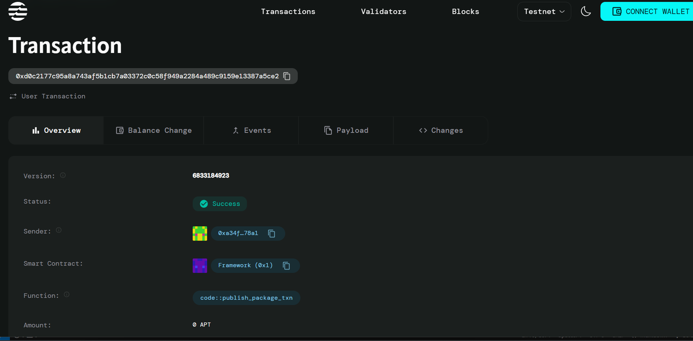

# 🏆 Achievement System

## Project Description
Create on-chain achievements with NFT rewards - A blockchain-based achievement system that tracks player accomplishments and automatically mints NFT rewards when milestones are reached. Built on Aptos blockchain using Move smart contracts.

## 🎯 Project Vision
To revolutionize digital achievement systems by leveraging blockchain technology to create verifiable, tradeable, and permanent records of player accomplishments. Our vision is to build a decentralized ecosystem where achievements have real value and can be showcased across multiple platforms and games.

## ✨ Key Features

### 🔗 **On-Chain Achievement Tracking**
- Permanent, immutable record of all player achievements
- Transparent verification system for accomplishments
- Cross-platform achievement compatibility

### 🎨 **Automatic NFT Rewards**
- Instant NFT minting upon achievement unlock
- Unique metadata for each achievement type
- Tradeable digital collectibles with real utility

### 📊 **Comprehensive Player Profiles**
- Total achievement count tracking
- Cumulative score calculation
- Achievement unlock timestamp records

### 🎮 **Game Integration Ready**
- Simple API for game developers to integrate
- Event-driven architecture for real-time updates
- Flexible achievement ID system for custom achievements

### 💎 **Rarity & Value System**
- Different achievement tiers (Common, Rare, Epic, Legendary)
- Score-based reward calculations
- Limited edition achievements for special events

## 🚀 Future Scope

### 🌐 **Multi-Game Ecosystem**
- Cross-game achievement sharing and recognition
- Universal player reputation system
- Achievement-based matchmaking and tournaments

### 🏪 **NFT Marketplace Integration**
- Built-in marketplace for trading achievement NFTs
- Auction system for rare achievements
- Achievement rental system for temporary boosts

### 🤝 **Social Features**
- Achievement showcases and galleries
- Friend comparison and leaderboards
- Guild and team-based achievements

### 🎯 **Advanced Achievement Types**
- Time-limited seasonal achievements
- Community-driven achievement creation
- Dynamic achievements that evolve over time

### 🔮 **DeFi Integration**
- Yield farming with achievement NFTs
- Staking rewards for achievement holders
- Achievement-backed lending protocols

### 📱 **Mobile & Web Apps**
- Dedicated achievement tracking mobile app
- Web dashboard for portfolio management
- Push notifications for new achievements

### 🛠 **Developer Tools**
- Achievement creation SDK
- Analytics dashboard for game developers
- A/B testing tools for achievement mechanics

### 🌍 **Cross-Chain Compatibility**
- Multi-blockchain achievement bridging
- Interoperable NFT standards
- Universal achievement protocol

## Contract Details
0xd0c2177c95a8a743af5b1cb7a03372c0c58f949a2284a489c9159e13387a5ce2
